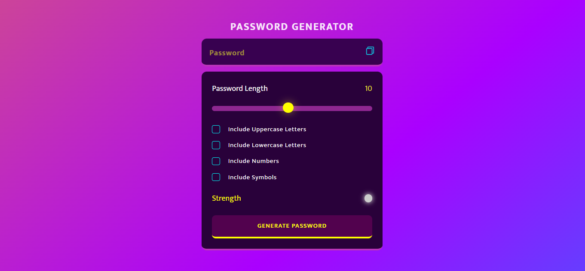

# Random Password Generator

## Table of Contents

- [Description](#description)
- [Live Demo](#live-demo)
- [Preview](#preview)
- [Features](#features)
- [Technologies Used](#technologies-used)

## Description

The Password Generator is a web application built using HTML, CSS, and JavaScript. It provides a user-friendly interface to generate secure and customizable passwords based on various criteria, including length, uppercase letters, lowercase letters, numbers, and symbols.

## Live Demo

Explore the live demo of the Password Generator [here](https://vijayaadamane.github.io/Random-Password-Generator/).

## Preview

## Features

- **Password Length Customization:** Use an interactive slider to set the desired length of your password.
- **Character Options:** 
  - Uppercase Letters
  - Lowercase Letters
  - Numbers
  - Symbols
- **Real-time Strength Indicator:** View the strength of your generated password instantly.
- **Copy to Clipboard:** Easily copy your generated password for immediate use.

## How to Use

1. Open the [Password Generator](https://vijayaadamane.github.io/Random-Password-Generator/) in your web browser.
2. Adjust your password preferences using the provided options.
3. Click the "Generate Password" button.
4. Your generated password will be displayed in the input field.
5. Click the "Copy" button to copy the password to your clipboard.

## Technologies Used

- HTML
- CSS
- JavaScript

